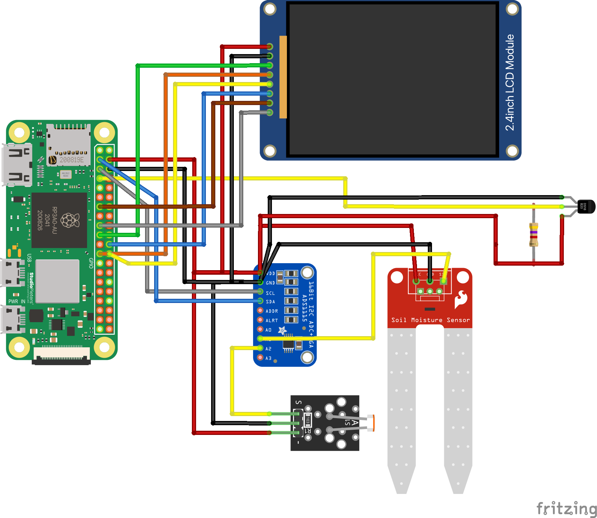
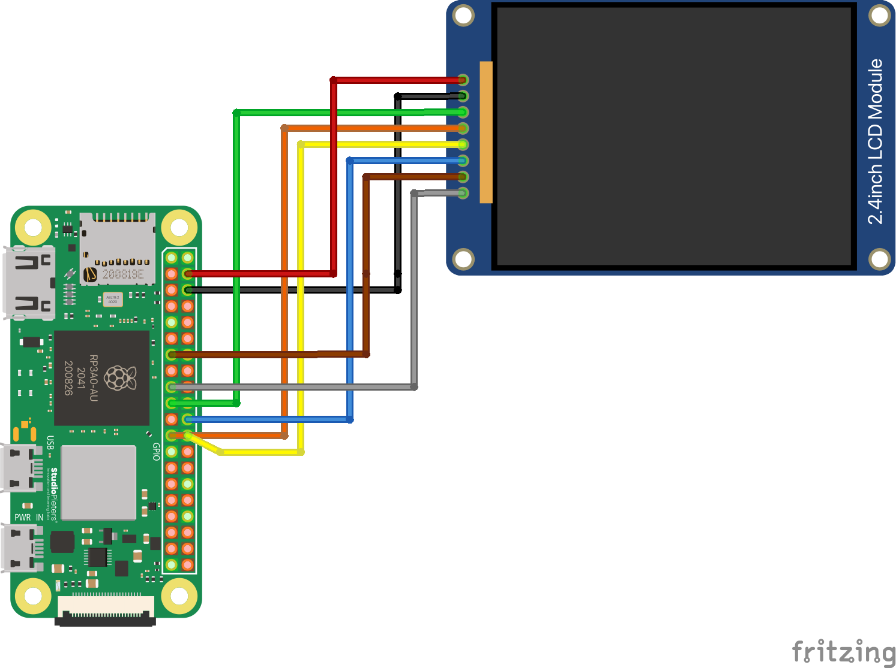
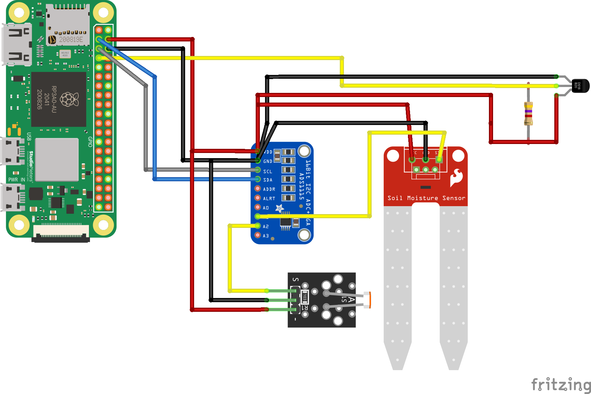
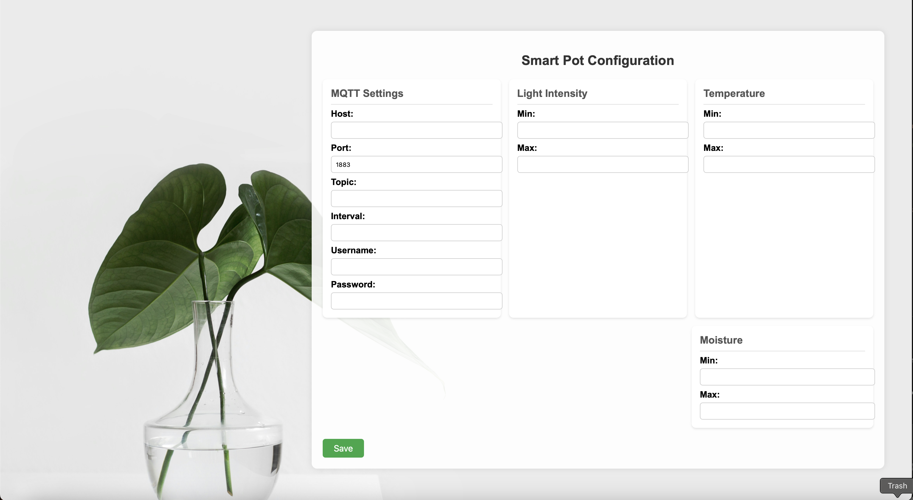

# Smart Plant Pot

Inspired by [Fyto Project](https://www.hackster.io/coderscafe/fyto-turn-your-plant-into-pet-1373d5#code)

## Hardware components
- Raspberry Pi Zero 2 W
- ADS1115 ADC Module 16Bit 4 channels for Raspberry Pi
- Soil Moisture Sensor Hygrometer Module V1.2
- DS18B20 digital temperature sensor
- LDR-Lichtsensor resistiv
- Power Distributor Terminal Block 2x12

## Wiring
### Complete wiring of smart pot.


### Wiring of the LCD display with RPI Zero 2 W.


### Wiring of sensors with RPI Zero 2 W.


## Installation & Setup

### Prerequisites
- Python 3.11 or later
- Virtual environment (recommended)
- MQTT server
- Dependencies from `requirements.txt`

### Using DS18B20 Temperature Sensor with Raspberry Pi Zero 2 W

This guide explains how to set up and read data from the **DS18B20** temperature sensor on a **Raspberry Pi Zero 2 W**.

### Wiring the DS18B20 Sensor

| DS18B20 Pin | Raspberry Pi GPIO |
|-------------|------------------|
| **VCC** (3.3V or 5V) | Pin 1 (3.3V) or Pin 2/4 (5V) |
| **GND** | Pin 6 (GND) |
| **DATA** | GPIO 4 (Pin 7) |

see wiring diagrams above.

🔹 **Important:**  
- A **4.7kΩ pull-up resistor** is required between **DATA** and **VCC**.

### Enabling 1-Wire Interface on Raspberry Pi

1. Enable the **1-Wire** interface in raspi-config.
```bash
sudo raspi-config
```
Choose Interfacing Options → 1-Wire → Enable.

2. Reboot.
```bash
sudo reboot
```

Alternatively you can manually activate the **1-Wire** interface

1. Load the **1-Wire** module.
```bash
sudo modprobe w1-gpio
sudo modprobe w1-therm
```

2. Add **1-Wire** module to /etc/modules to ensure it will reloaded on reboot.
```bash
echo "w1-gpio" | sudo tee -a /etc/modules
echo "w1-therm" | sudo tee -a /etc/modules
```

3. Reboot.
```bash
sudo reboot
```

4. Ensure the sensor is recognized correctly.
```bash
ls /sys/bus/w1/devices/
```
You should see a directory with a name like 28-xxxxxxxxxxxx.
If the sensor is not listed, check the wiring and the pull-up resistor.

### Using ADS1115 on the RPI Zero 2 W.

1. Enabling I²C on the Raspberry Pi

To use the ADS1115, you need to enable the I²C interface on your Raspberry Pi.

1. Open the Raspberry Pi configuration tool:
   ```bash
   sudo raspi-config
   ```
2. Navigate to **Interfacing Options** → **I2C** → **Enable**.
3. Exit the tool and reboot your Raspberry Pi:
   ```bash
   sudo reboot
   ```


2. Checking if the ADS1115 is Detected

After rebooting, check if the Raspberry Pi detects the **ADS1115**:

1. Install the I²C tools (if not already installed):
   ```bash
   sudo apt install -y i2c-tools
   ```
2. Scan for connected I²C devices:
   ```bash
   i2cdetect -y 1
   ```

**Expected Output (if `ADDR` is connected to GND, default address 0x48):**
```
     0  1  2  3  4  5  6  7  8  9  A  B  C  D  E  F
00:          -- -- -- -- -- -- -- -- -- -- -- -- --  
10: -- -- -- -- -- -- -- -- -- -- -- -- -- -- -- --  
20: -- -- -- -- -- -- -- -- -- -- -- -- -- -- -- --  
30: -- -- -- -- -- -- -- -- -- -- -- -- -- -- -- --  
40: -- -- -- -- -- -- -- -- 48 -- -- -- -- -- -- --  
```
If no address appears, check the **wiring** and ensure I²C is **enabled**.

### Installation
1. **Clone the repository:**
   ```sh
   git clone <repository-url>
   cd <repository-name>
   ```

2. **Create & activate a virtual environment:**
   ```sh
   python -m venv venv
   source venv/bin/activate  # macOS/Linux
   venv\Scripts\activate     # Windows
   ```

3. **Install dependencies:**
   ```sh
   pip install -r requirements.txt
   ```

### Calibrate sensors / verify sensors are running
```sh
python calibration.py
```
You should see every second a values for Moisture, Light Intensity and Temperature in the Terminal. Something like:
```bash
Moisture: 73
Light Intensity: 4567
Temperature: 23.45 °C
```
This could be used to verify the wiring is correct and the sensors measure plausible values.

## Usage

### **Start the Main Program**
The `main.py` script starts the configuration server and sensor system as subprocesses.
```sh
python main.py
```

### **Configure Smart Pot via Configuration Server**
Open a web browser and connect to the configuration server with the following address: `https://PI-ZERO-IP-ADDR:5000`



Set the parameter as shown in the screenshot above. MQTT User and Password are optional.
The following parameter can be used as default for light intensity, temperature and moisture:
- Light intensity min: 20
- Light intensity max: 20

- Temperature min: 22
- Temperature max: 30

- Moisture min: 10
- Moisture max: 90

Then press the button save.
You should now see values for Light, Temperature and Moisture published on the given topic on your MQTT server. This means your smart pot is up and running. Additionally the LCD display shows you the current state of your plant, visualized with some simleys.

## API Endpoints (config_server.py)
| Method  | Endpoint       | Description |
|---------|---------------|-------------|
| `GET`   | `/config`     | Retrieve configuration settings |
| `POST`  | `/config`     | Set configuration settings |

### Configurable Parameters:
The following parameters can be set via the `/config` endpoint:
- `moisture` (int): The soil moisture level at which watering should be triggered.
- `temperature` (float): Maximum temperature before triggering an alert.
- `light` (int): Minimum required light intensity for the plant.


## Troubleshooting
- If you encounter a `Permission denied` error, try running the script with `sudo` or changing the port number.
- Ensure that `pip install -r requirements.txt` has been executed.

## License
This project is licensed under the MIT License.

